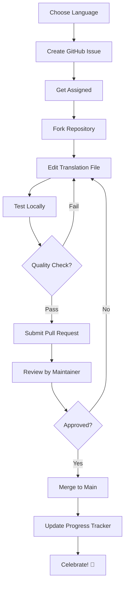

# Translation Progress Tracker

## Overview

Track the translation status of all 70+ supported languages for the Esperanto learning website.

**Last Updated**: January 2025
**Total Languages**: 70+
**Fully Translated**: 2
**In Progress**: 0
**Not Started**: 64

---

## Translation Status Legend

- ✅ **Complete**: Fully translated and reviewed
- 🚧 **In Progress**: Translation started, not yet complete
- ⏳ **Not Started**: Contains English placeholders
- 🔍 **Review Needed**: Translation complete, awaiting review
- ⚠️ **Needs Update**: Translation outdated due to content changes

---

## Priority Languages (by speaker population)

These languages should be translated first to maximize impact:

| Language | Code | Status | Translator | Progress | Notes |
|----------|------|--------|------------|----------|-------|
| Spanish | `es` | ⏳ Not Started | - | 0% | 500M+ speakers |
| French | `fr` | ⏳ Not Started | - | 0% | 280M+ speakers |
| German | `de` | ⏳ Not Started | - | 0% | 130M+ speakers |
| Russian | `ru` | ⏳ Not Started | - | 0% | 260M+ speakers |
| Chinese | `zh` | ⏳ Not Started | - | 0% | 1.3B+ speakers |
| Japanese | `ja` | ⏳ Not Started | - | 0% | 125M+ speakers |
| Portuguese | `pt` | ⏳ Not Started | - | 0% | 260M+ speakers |
| Italian | `it` | ⏳ Not Started | - | 0% | 85M+ speakers |

---

## All Languages (Alphabetical by Code)

### A-E

| Language | Code | Native Name | Status | Translator | Last Updated |
|----------|------|-------------|--------|------------|--------------|
| Afrikaans | `af` | Afrikaans | ⏳ Not Started | - | - |
| Albanian | `sq` | Shqip | ⏳ Not Started | - | - |
| Arabic | `ar` | العربية | ⏳ Not Started | - | - |
| Belarusian | `be` | Беларуская | ⏳ Not Started | - | - |
| Bengali | `bn` | Bengali | ⏳ Not Started | - | - |
| Bosnian | `bs` | Bosanski | ⏳ Not Started | - | - |
| Breton | `br` | Brezhoneg | ⏳ Not Started | - | - |
| Bulgarian | `bg` | Български | ⏳ Not Started | - | - |
| Catalan | `ca` | Català | ⏳ Not Started | - | - |
| Chinese | `zh` | 汉语 | ⏳ Not Started | - | - |
| Chuvash | `cv` | Чăваш | ⏳ Not Started | - | - |
| Croatian | `hr` | Hrvatski | ⏳ Not Started | - | - |
| Czech | `cs` | Česky | ⏳ Not Started | - | - |
| Danish | `da` | Dansk | ⏳ Not Started | - | - |
| Dutch | `nl` | Nederlands | ⏳ Not Started | - | - |
| **English** | `en` | **English** | ✅ **Complete** | System | Jan 2025 |
| **Esperanto** | `eo` | **Esperanto** | ✅ **Complete** | System | Jan 2025 |
| Estonian | `et` | Eesti | ⏳ Not Started | - | - |

### F-J

| Language | Code | Native Name | Status | Translator | Last Updated |
|----------|------|-------------|--------|------------|--------------|
| Basque | `eu` | Euskara | ⏳ Not Started | - | - |
| Finnish | `fi` | Suomi | ⏳ Not Started | - | - |
| French | `fr` | Français | ⏳ Not Started | - | - |
| Frisian | `fy` | Frysk | ⏳ Not Started | - | - |
| Galician | `gl` | Galego | ⏳ Not Started | - | - |
| German | `de` | Deutsch | ⏳ Not Started | - | - |
| Greek | `el` | Ελληνικά | ⏳ Not Started | - | - |
| Hebrew | `he` | עברית | ⏳ Not Started | - | - |
| Hindi | `hi` | हिन्दी | ⏳ Not Started | - | - |
| Hungarian | `hu` | Magyar | ⏳ Not Started | - | - |
| Icelandic | `is` | Íslenska | ⏳ Not Started | - | - |
| Indonesian | `id` | Indonesia | ⏳ Not Started | - | - |
| Irish | `ga` | Gaeilge | ⏳ Not Started | - | - |
| Italian | `it` | Italiano | ⏳ Not Started | - | - |
| Japanese | `ja` | 日本語 | ⏳ Not Started | - | - |

### K-O

| Language | Code | Native Name | Status | Translator | Last Updated |
|----------|------|-------------|--------|------------|--------------|
| Korean | `ko` | 한글 | ⏳ Not Started | - | - |
| Latvian | `lv` | Latviešu | ⏳ Not Started | - | - |
| Lithuanian | `lt` | Lietuviškai | ⏳ Not Started | - | - |
| Luxembourgish | `lb` | Lëtzebuergësch | ⏳ Not Started | - | - |
| Macedonian | `mk` | Македонски | ⏳ Not Started | - | - |
| Malagasy | `mg` | Malagasy | ⏳ Not Started | - | - |
| Maltese | `mt` | Malti | ⏳ Not Started | - | - |
| Norwegian | `no` | Norsk | ⏳ Not Started | - | - |
| Occitan | `oc` | Occitan | ⏳ Not Started | - | - |
| Ossetian | `os` | Ирон | ⏳ Not Started | - | - |

### P-T

| Language | Code | Native Name | Status | Translator | Last Updated |
|----------|------|-------------|--------|------------|--------------|
| Persian | `fa` | فارسى | ⏳ Not Started | - | - |
| Polish | `pl` | Polski | ⏳ Not Started | - | - |
| Portuguese | `pt` | Português | ⏳ Not Started | - | - |
| Romanian | `ro` | Română | ⏳ Not Started | - | - |
| Romansh | `rm` | Rumantsch | ⏳ Not Started | - | - |
| Kirundi | `rn` | Kirundi | ⏳ Not Started | - | - |
| Russian | `ru` | Русский | ⏳ Not Started | - | - |
| Serbian | `sr` | Srpski | ⏳ Not Started | - | - |
| Slovak | `sk` | Slovenčina | ⏳ Not Started | - | - |
| Slovenian | `sl` | Slovenščina | ⏳ Not Started | - | - |
| Sorbian | `sb` | Serbski | ⏳ Not Started | - | - |
| Spanish | `es` | Español | ⏳ Not Started | - | - |
| Swahili | `sw` | Kiswahili | ⏳ Not Started | - | - |
| Swedish | `sv` | Svenska | ⏳ Not Started | - | - |
| Tagalog | `tl` | Tagalog | ⏳ Not Started | - | - |
| Tajik | `tg` | тоҷикӣ | ⏳ Not Started | - | - |
| Telugu | `te` | Telugu | ⏳ Not Started | - | - |
| Thai | `th` | ไทย | ⏳ Not Started | - | - |
| Turkish | `tr` | Türkçe | ⏳ Not Started | - | - |

### U-Z

| Language | Code | Native Name | Status | Translator | Last Updated |
|----------|------|-------------|--------|------------|--------------|
| Ukrainian | `uk` | Українська | ⏳ Not Started | - | - |
| Vietnamese | `vi` | Tiếng Việt | ⏳ Not Started | - | - |
| Walloon | `wa` | Walon | ⏳ Not Started | - | - |
| Welsh | `cy` | Cymraeg | ⏳ Not Started | - | - |

---

## Translation Statistics

### Overall Progress

```
Total Languages:     70+
Fully Translated:    2  (2.9%)
In Progress:         0  (0%)
Not Started:         64 (97.1%)

Progress Bar: [▓░░░░░░░░░░░░░░░░░░░░░░░░░░░░░░░░░] 2.9%
```

### By Language Family

| Family | Languages | Translated | In Progress | Not Started |
|--------|-----------|------------|-------------|-------------|
| **Romance** | 9 | 1 (Esperanto*) | 0 | 8 |
| **Germanic** | 11 | 1 (English) | 0 | 10 |
| **Slavic** | 13 | 0 | 0 | 13 |
| **Asian** | 8 | 0 | 0 | 8 |
| **Celtic** | 4 | 0 | 0 | 4 |
| **Uralic** | 3 | 0 | 0 | 3 |
| **Semitic** | 2 | 0 | 0 | 2 |
| **Other** | 20+ | 0 | 0 | 20+ |

*_Esperanto is a constructed language based on Romance and other European languages_

### By Writing System

| Script | Languages | Translated | Not Started |
|--------|-----------|------------|-------------|
| **Latin** | 50+ | 2 | 48+ |
| **Cyrillic** | 9 | 0 | 9 |
| **Asian** | 8 | 0 | 8 |
| **Arabic** | 2 | 0 | 2 |
| **Hebrew** | 1 | 0 | 1 |

---

## Translation Quality Metrics

### Review Checklist

For each completed translation, verify:

- [ ] All translation keys present
- [ ] No missing translations (no English fallbacks)
- [ ] Grammar and spelling correct
- [ ] Cultural appropriateness verified
- [ ] Formatting preserved (bold, italics, links)
- [ ] Special characters properly encoded
- [ ] RTL languages (Arabic, Hebrew, Persian) tested
- [ ] Native speaker review completed
- [ ] `translationStatus` updated to "complete"
- [ ] Translator credited in `_meta` object

---

## How to Claim a Language

### For Contributors

1. **Choose a Language**: Pick an unclaimed language from the list above
2. **Create an Issue**: Open a GitHub issue titled "Translation: [Language Name]"
3. **Get Assigned**: Wait for maintainer to assign you
4. **Start Translating**: Follow the TRANSLATION_GUIDE.md
5. **Submit PR**: Create a pull request when complete
6. **Update This File**: Mark language as "In Progress" with your name

### GitHub Issue Template

```markdown
## Translation Request: [Language Name]

**Language Code**: [e.g., es]
**Native Name**: [e.g., Español]
**Your Name/Username**: [Your name]
**Estimated Completion**: [Date]

### Checklist
- [ ] I am a native or fluent speaker of this language
- [ ] I have read the TRANSLATION_GUIDE.md
- [ ] I understand the JSON file structure
- [ ] I will maintain cultural appropriateness
- [ ] I can commit to completing the translation

### Notes
[Any additional information]
```

---

## Translation Milestones

### Milestone 1: Priority Languages (Target: Month 1)
- [ ] Spanish (es)
- [ ] French (fr)
- [ ] German (de)
- [ ] Russian (ru)
- [ ] Chinese (zh)
- [ ] Japanese (ja)
- [ ] Portuguese (pt)
- [ ] Italian (it)

**Impact**: Covers 2.5+ billion speakers

### Milestone 2: European Languages (Target: Month 2)
- [ ] Polish (pl)
- [ ] Dutch (nl)
- [ ] Swedish (sv)
- [ ] Czech (cs)
- [ ] Romanian (ro)
- [ ] Hungarian (hu)
- [ ] Greek (el)
- [ ] Bulgarian (bg)
- [ ] Croatian (hr)
- [ ] Slovak (sk)

**Impact**: Covers most of Europe

### Milestone 3: Asian Languages (Target: Month 3)
- [ ] Korean (ko)
- [ ] Vietnamese (vi)
- [ ] Thai (th)
- [ ] Hindi (hi)
- [ ] Bengali (bn)
- [ ] Telugu (te)
- [ ] Indonesian (id)
- [ ] Tagalog (tl)

**Impact**: Covers South and Southeast Asia

### Milestone 4: Other Languages (Target: Month 4-6)
- [ ] All remaining languages
- [ ] Regional variants (if needed)
- [ ] Community-requested languages

---

## Translation Workflow

### Step-by-Step Process



### Estimated Time per Language

- **Small Languages** (Celtic, Regional): 2-4 hours
- **Medium Languages** (European): 4-8 hours
- **Large Languages** (Global): 8-16 hours
- **Complex Scripts** (Asian, RTL): +2-4 hours for testing

---

## Recognition

### Top Contributors

| Contributor | Languages | Lines Translated | Join Date |
|-------------|-----------|------------------|-----------|
| *Awaiting contributors* | - | - | - |

### Hall of Fame

Contributors who translate 3+ languages will be featured here!

---

## Resources for Translators

### Tools

- **JSON Editor**: [jsoneditoronline.org](https://jsoneditoronline.org/)
- **Translation Memory**: [Google Translate](https://translate.google.com/) (for reference only)
- **Grammar Check**: [LanguageTool](https://languagetool.org/)
- **Character Map**: For special characters in your language

### Documentation

- **TRANSLATION_GUIDE.md**: Complete translation instructions
- **MULTILINGUAL_SUPPORT.md**: Technical implementation details
- **en.json**: English reference for all translations
- **eo.json**: Esperanto reference (our source language)

### Community

- **GitHub Discussions**: Ask questions and collaborate
- **Discord**: [Join our translation channel] (if applicable)
- **Forum**: [Esperanto community forum] (if applicable)

---

## Notes

### Translation Philosophy

When translating, prioritize:

1. **Accuracy**: Convey the exact meaning
2. **Cultural Appropriateness**: Adapt idioms and expressions
3. **Consistency**: Use the same terms throughout
4. **Naturalness**: Sound like a native speaker wrote it
5. **Clarity**: Be clear and easy to understand

### Special Considerations

**RTL Languages** (Arabic, Hebrew, Persian):
- Text direction handled automatically
- Test layout carefully
- Verify UI doesn't break

**Asian Languages** (Chinese, Japanese, Korean):
- Character encoding: UTF-8
- Font rendering may vary by system
- Test on multiple devices

**Esperanto-Specific Terms**:
- Keep Esperanto terms in Esperanto (e.g., "saluton", "dankon")
- Translate explanations of Esperanto concepts
- Maintain educational value

---

## Contact

Questions about translation? Contact:

- **Email**: [Project email]
- **GitHub**: Create an issue with "translation" label
- **Discord**: [Server link] (if applicable)

---

**Last Updated**: January 2025
**Next Review**: Monthly
**Maintained By**: Victor Williams (@Vaporjawn)

---

*Thank you to all translators making Esperanto accessible worldwide! 🌍*
